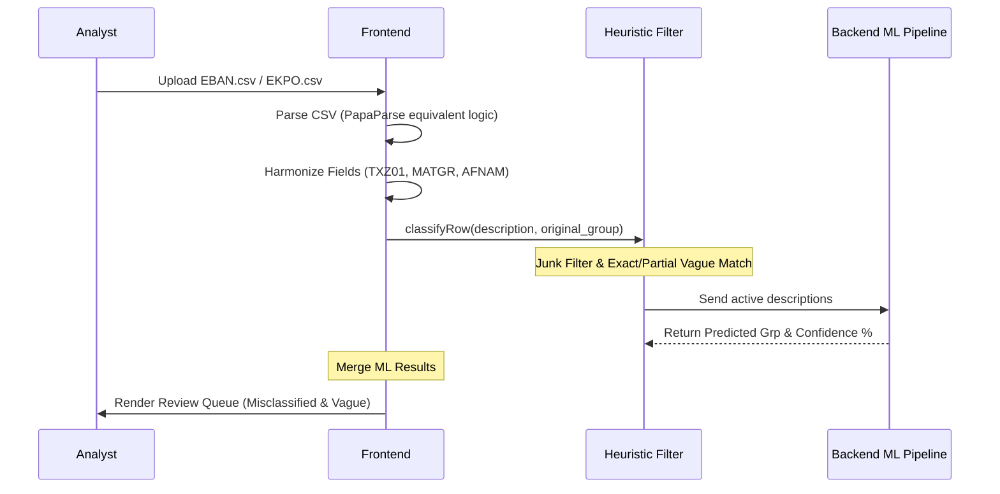
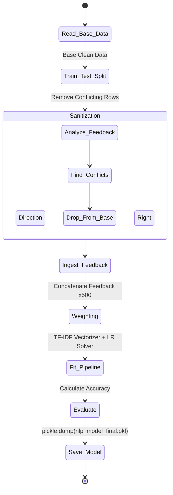

# PR/PO Intelligence Dashboard - Architecture & Workflow

> [!NOTE]  
> This visual documentation provides an end-to-end breakdown of the PR/PO Standardisation Dashboard, detailing the parsing engine, machine learning lifecycle, and feedback mechanisms.

---

## 1. High-Level System Architecture

The following diagram illustrates the interaction between the SAP Data Extracts (Frontend) and the ML Engine (Backend), highlighting the persistent feedback loop.

```mermaid
graph TD
    subgraph Frontend [Browser Client / dashboard.html]
        Upload[SAP Extracts: EBAN / EKPO]
        Parser[CSV Parser & Data Harmonization]
        ClassifierJS[Pre-Classification Rule Engine]
        UI[Review Dashboard & UI]
    end

    subgraph Backend [Flask Server / app.py]
        API_Classify[/api/classify]
        API_Feedback[/api/feedback]
        Model[(nlp_model_final.pkl)]
        FeedbackCSV[(feedback.csv)]
        Retrainer[retrain_model Thread]
    end

    Upload --> Parser
    Parser --> ClassifierJS
    ClassifierJS -- "Batch Descriptions" --> API_Classify
    API_Classify -- "TF-IDF + LogReg" --> Model
    Model -- "Predictions & Confidence" --> UI
    
    UI -- "Analyst Corrections" --> API_Feedback
    API_Feedback --> FeedbackCSV
    FeedbackCSV -- "Every 10 Corrections" --> Retrainer
    Retrainer -- "500x Weight Sanitization" --> Model
```

---

## 2. API Endpoint Specification

The backend (`app.py`) serves 14 distinct API routes. Below are the most critical endpoints for the system's operation.

| Endpoint | Method | Purpose | Key Behavior |
| :--- | :---: | :--- | :--- |
| `/api/classify` | `POST` | Bulk predicts material groups | Uses TF-IDF. Returns top 3 predictions + confidence %. Falls back to regex if model is missing. |
| `/api/feedback` | `POST` | Records human corrections | Appends to `feedback.csv`. Triggers async retrain if `count % 10 == 0`. |
| `/api/retrain` | `POST` | Forces model replacement | Runs Pipeline train loop in background thread. Re-weights corrections 500x. |
| `/api/verify-learning`| `GET` | Validates model improvement | Reads `feedback.csv`, queries current model, compares old vs new confidence. |
| `/api/chat` | `POST` | Generates AI Insights | Interfaces with Groq Llama-3.3-70b-versatile. |
| `/api/feedback/export`| `GET` | Exports system memory | Triggers secure CSV download of the analyst feedback DB. |

---

## 3. Data Processing & Harmonization Lifecycle

When an analyst uploads an EBAN or EKPO extract, the frontend normalizes the German SAP column headers into a standard JSON payload format before analysis.



---

## 4. The Heuristic Rule Logic (JS Pre-Classification)

Before data touches the ML engine, the frontend runs heuristics:

| Issue Type | Logic | Example Triggers |
| :--- | :--- | :--- |
| **Blank / Junk** | Exact match against `JUNK_SET` or null. | `"na"`, `"-"`, `"."` |
| **Vague (Exact)** | Perfect match against `VAGUE_SET`. | `"consumables"`, `"spares"`, `"parts"` |
| **Vague (Partial)** | Substring match against `VAGUE_SET` (Only multi-word, >8 chars). | `"as per indent"`, `"refer email"` |
| **Clean** | ML confidence > 95% AND AI matches SAP Group. | `"Bearing Assembly"` (MECH) |

> [!WARNING]  
> The Vague partial match engine strictly enforces a rule requiring `vague phrases` to contain a space (multi-word) and be at least 8 characters long, preventing false positives like flagging "steel material" because it contains "material."

---

## 5. Machine Learning Retraining Topology

The most complex element of the dashboard is the self-healing machine learning loop triggering via the `retrain_model()` function lock.



### Sanitization Process Explained
1. **Deduplication**: If an analyst corrects the description "steel bearings" multiple times, only the **latest** correction is retained using `keep='last'`.
2. **Conflict Removal**: The system aggressively searches the historical base training data. If it finds any description that matches the new analyst correction, it **deletes** the historical record. This prevents the model from being confused by conflicting rules.
3. **500x Amplification**: To guarantee the model respects the human override, the correction record is multiplied by 500, forcing the Logistic Regression weights to tilt heavily toward the analyst's truth.

> [!TIP]  
> Test accuracy is measured purely against a 15% holdout of the **Base Clean Data** (before feedback is injected). This guarantees the dashboard reports an honest accuracy metric (usually ~98.0%) that hasn't been skewed by data duplication.
